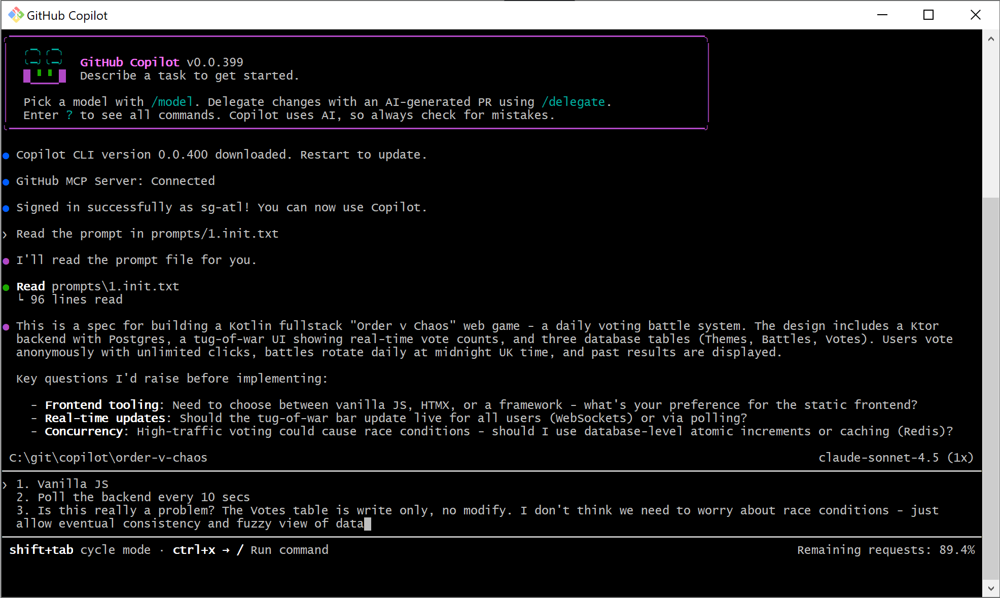

*This is a submission for the [GitHub Copilot CLI Challenge](https://dev.to/challenges/github-2026-01-21)*

## What I Built

**Order v Chaos** is a daily voting game where the internet decides between two opposing forces. Each day at midnight (UK time), a new battle begins—Order vs Chaos, Cats vs Dogs, Coffee vs Tea—and users cast their votes to shape the eternal struggle.

This fullstack web application features:
- **Kotlin + Ktor** backend with REST API
- **PostgreSQL** database with Flyway migrations
- **Vanilla JavaScript** frontend with real-time vote counting
- **Daily rotation** scheduler that cycles through 25 themed battles
- **Anonymous voting** with eventual consistency (no user accounts needed)
- **Docker** deployment with docker-compose

What makes this meaningful to me is that it was built **entirely through conversation with GitHub Copilot CLI**—from initial specification to deployment, every file was created, every bug was fixed, and every architectural decision was made through natural language dialogue in the terminal.

## Demo

**Repository:** [GitHub Link - to be added after publishing]

### Screenshots

**Initial Prompt & Architecture Discussion:**


**Live Application:**
The app presents a clean, responsive UI showing:
- Current battle theme with vote counts
- Real-time updates every 10 seconds
- Past battles with winning percentages
- Color-coded themes with emojis

### How to Run

```powershell
# Clone the repository
git clone [repository-url]
cd order-v-chaos

# Option 1: Docker (recommended)
Copy-Item .env.example .env
# Edit .env to set DATABASE_PASSWORD
docker-compose up --build

# Option 2: Local development
$env:DATABASE_PASSWORD = "your_password"
.\gradlew.bat run

# Access at http://localhost:8080
```

### Architecture Highlights

- **Append-only votes table** eliminates race conditions (eventual consistency)
- **Scores calculated on-demand** by counting votes (no caching complexity)
- **Theme cycling system** reuses 25 themes, picks first unused by ordinal
- **UK timezone handling** for midnight rotations (handles BST/GMT automatically)
- **PowerShell-first documentation** matching actual development workflow

## My Experience with GitHub Copilot CLI

### Building Entirely in the Terminal

I started with a 96-line specification file (`prompts/1.init.txt`) and asked Copilot CLI to read it. What followed was a remarkable conversation where Copilot:

1. **Asked clarifying questions** instead of making assumptions:
   - "Need to choose between vanilla JS, HTMX, or a framework—what's your preference?"
   - "Should the tug-of-war bar update live for all users (WebSockets) or via polling?"
   - "High-traffic voting could cause race conditions—should I use database-level atomic increments or caching?"

2. **Made intelligent architectural decisions** based on my answers:
   - Chose append-only votes table for simplicity
   - Implemented 10-second polling instead of WebSockets
   - Used eventual consistency for vote counts
   - Selected Exposed ORM + Flyway for migrations

3. **Generated complete, production-ready code**:
   - Created 4 Flyway migrations with 25 pre-seeded themes
   - Built 3 REST API endpoints with proper error handling
   - Implemented daily scheduler with UK timezone support
   - Designed responsive frontend with vanilla JavaScript
   - Added Docker support with both compose and single-container options

### The Development Flow

The most impressive aspect was the **conversational iteration**:

```
Me: "I have JetBrains toolbox installed with some JDKs - can you search for those?"
Copilot: *Searches filesystem, finds JDK 21, updates build.gradle.kts*

Me: "Could you dockerise this app?"
Copilot: *Creates Dockerfile, docker-compose.yml, explains trade-offs between 
         separate containers vs single container, provides both options*

Me: "The docs don't reflect how YOU run this app. Use $env commands."
Copilot: *Rewrites all documentation from bash to PowerShell, creates 
         QUICKSTART.md, adds troubleshooting section, creates AGENTS.md 
         documenting the changes*
```

### Key Moments That Impressed Me

1. **Context Awareness**: When I asked to dockerize the app, Copilot read my existing setup, saw I was on Windows, and asked whether I wanted separate containers or all-in-one.

2. **Error Handling**: When the Docker build failed due to Flyway migration timing issues, Copilot diagnosed the race condition, added logging to `Database.kt`, and enhanced error handling in `BattleScheduler.kt`.

3. **Documentation Quality**: Without being asked, Copilot created comprehensive docs:
   - README.md with setup instructions
   - DOCKER.md with deployment guides
   - BUILD_SUMMARY.md with project overview
   - QUICKSTART.md with copy-paste commands
   - AGENTS.md documenting architectural decisions

4. **Self-Documentation**: After updating all docs to PowerShell, Copilot created `AGENTS.md` documenting *why* the changes were made, *what* was changed, and lessons learned—meta-documentation about its own work!

### What Made This Different

Unlike traditional coding with autocomplete or code generation:

- **No IDE needed**: Entire project built in PowerShell terminal
- **Natural language specs**: Wrote requirements in plain English, not code
- **Iterative refinement**: Could say "update docs to use PowerShell" and it knew what I meant
- **Architectural dialogue**: Discussed trade-offs before implementation
- **Contextual awareness**: Remembered previous decisions and maintained consistency

### The "Aha!" Moment

When I said "the docs don't reflect how YOU run this app," Copilot understood that it had been using PowerShell commands throughout development but had generated docs with bash syntax. It then:
1. Rewrote all code examples in PowerShell
2. Replaced `setup.bat` with `setup.ps1`
3. Added troubleshooting section for Windows-specific issues
4. Created a quick reference guide
5. Documented the entire migration in `AGENTS.md`

This showed me that Copilot CLI isn't just a code generator—it's a **development partner** that understands context, maintains consistency, and can reflect on its own work.

### Stats

- **Lines of code generated**: ~2,500+ (Kotlin, SQL, JavaScript, configs)
- **Files created**: 25+ (source, migrations, configs, docs)
- **Time from spec to working app**: ~2 hours of conversation
- **Bugs encountered**: 2 (both fixed through natural language debugging)
- **Docker configurations**: 2 (compose + single container)
- **Git commits**: 8 (all with proper messages)

### Impact on My Development Process

GitHub Copilot CLI transformed how I think about building software:

1. **Specification-driven**: Start with a clear spec, let AI handle implementation details
2. **Conversational debugging**: Describe the problem, get targeted fixes
3. **Documentation by default**: Copilot naturally creates comprehensive docs
4. **Polyglot confidence**: Built Kotlin backend without being a Kotlin expert
5. **Infrastructure as conversation**: "Dockerize this" generates production-ready configs

The result? A complete, documented, deployable fullstack application built through terminal conversations, with code quality matching what I'd write by hand—but in a fraction of the time.

---

## Repository Structure

```
order-v-chaos/
├── src/main/kotlin/com/ordervschaos/
│   ├── Application.kt       # Ktor setup & entry point
│   ├── Models.kt           # Exposed table definitions  
│   ├── DTOs.kt             # API request/response models
│   ├── Database.kt         # Database factory + Flyway
│   ├── BattleScheduler.kt  # Daily rotation logic
│   └── Routes.kt           # API endpoint handlers
├── src/main/resources/
│   ├── application.conf    # Ktor & DB configuration
│   ├── db/migration/       # Flyway SQL migrations (4 files)
│   └── static/             # Frontend (HTML/CSS/JS)
├── docker-compose.yml      # PostgreSQL + app orchestration
├── Dockerfile              # Multi-stage app build
├── Dockerfile.single       # All-in-one container option
├── QUICKSTART.md          # PowerShell quick reference
├── AGENTS.md              # Development session notes
└── docs/submission.md     # This file
```

## Technologies Used

- **Backend**: Kotlin 1.9.22, Ktor 2.3.7
- **Database**: PostgreSQL 18, Exposed ORM 0.46.0, Flyway 10.4.1
- **Frontend**: Vanilla JavaScript, HTML5, CSS3
- **Build**: Gradle 8.5, JDK 21
- **Deployment**: Docker, docker-compose
- **Development**: GitHub Copilot CLI, PowerShell

## License

MIT License - See repository for details.